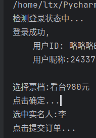
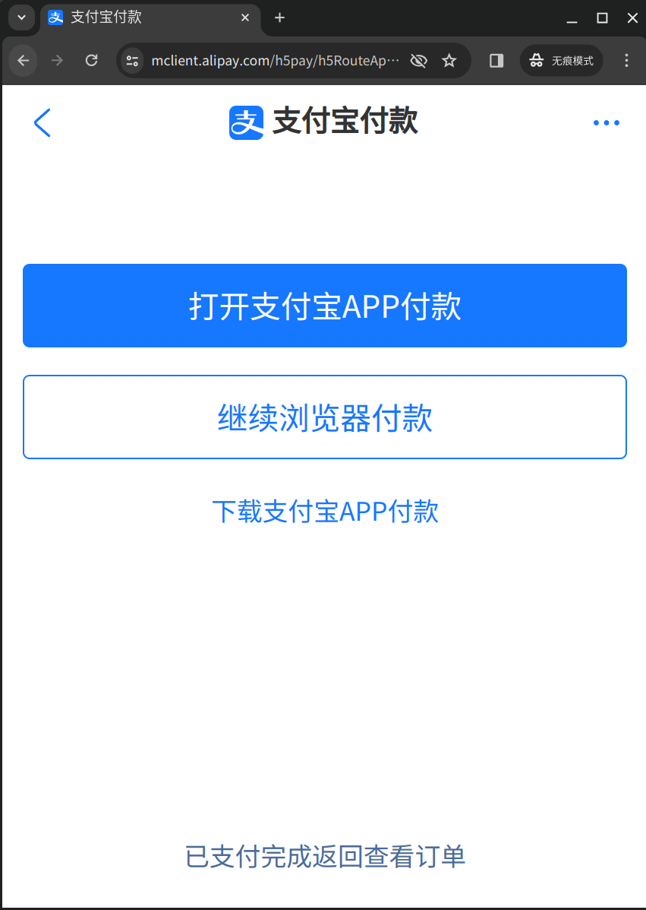
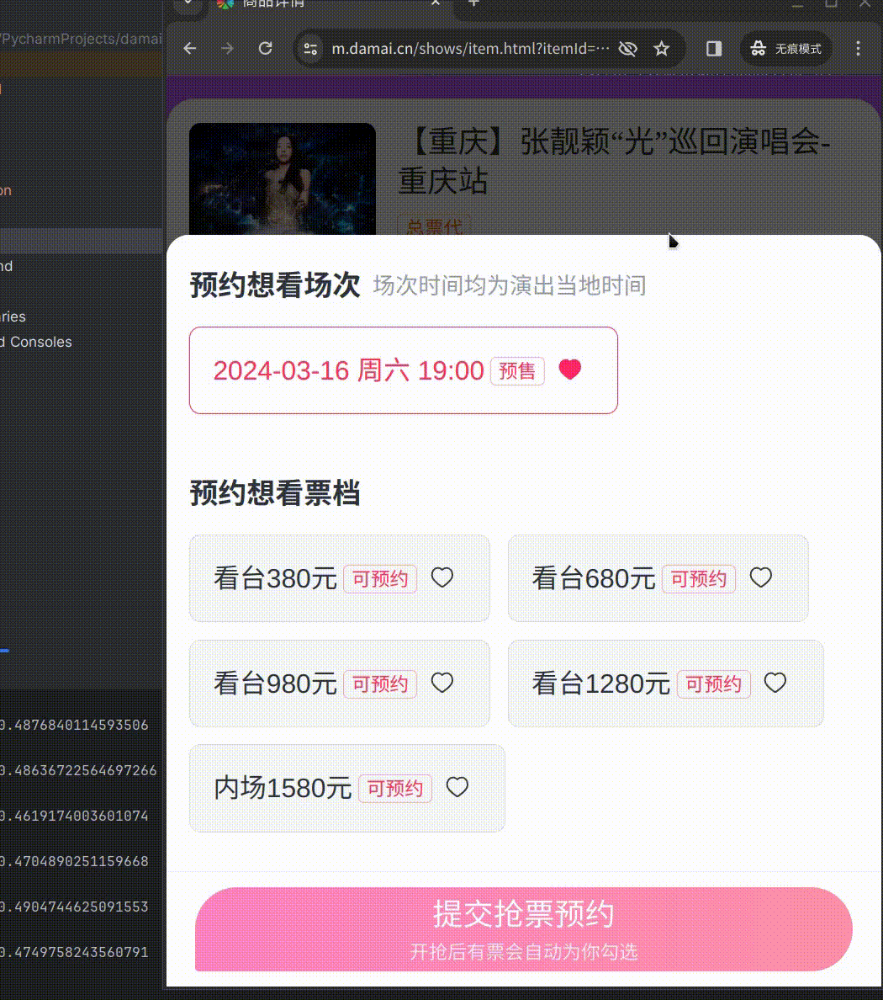
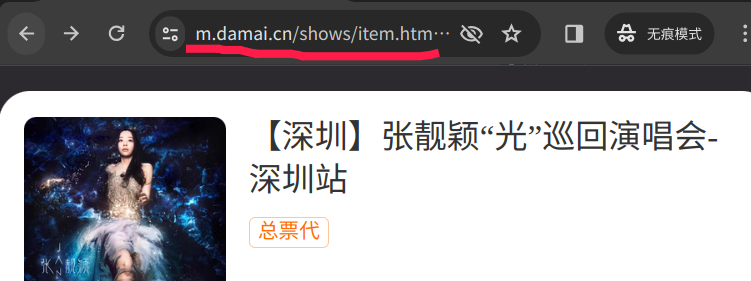
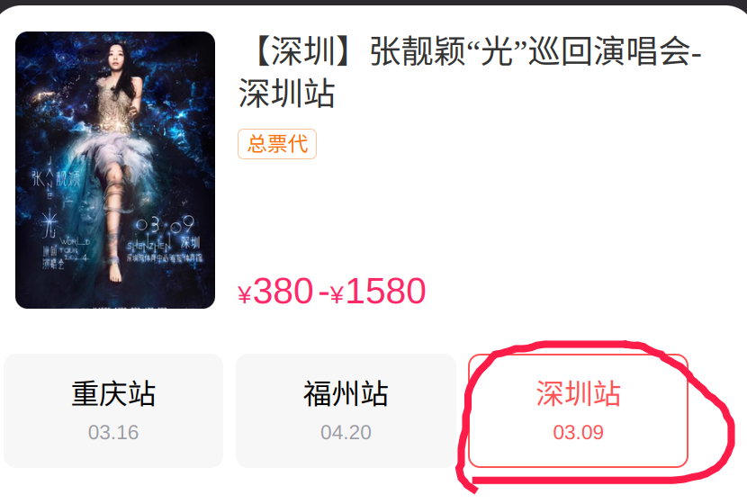
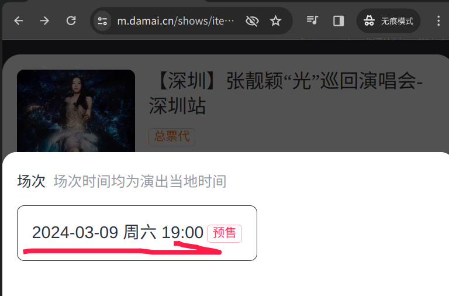
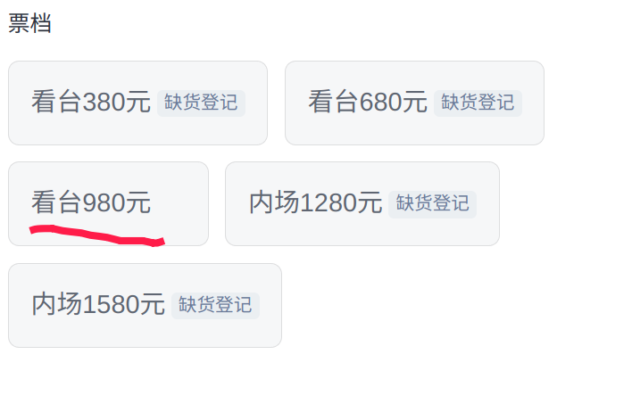

# damai-h5

## 简介

基于Python3 + DrissionPage开发的大麦H5版自动购票。

## 脚本效果

- 已开售：



- 未开售：

- 
[demo]

## 环境要求

- python 版本：3.6 及以上

- 已安装浏览器：Chromium 内核（如 Chrome 和 Edge）

## 使用教程

1. 克隆代码: `git clone https://github.com/ClassmateLin/damai-h5.git`
2. 安装virtualenv: `cd damai-h5.git && pip install virtualenv`
3. 创建并激活虚拟环境: `virtualenv .venv && source .venv/bin/activate`
4. 安装依赖: `pip install pyyaml DrissionPage`
5. 复制配置文件: `cp .config.yml config.yml`, 并修改配置文件内容。
6. 运行脚本: `python main.py`

## 配置说明:

- username: 大麦账号
- password: 大麦密码
- ticket_url: 需要购买的演唱会详情页面URL

- ticket_site: 需要购买哪个站点的门票, 演唱会详情页有选项, 如:深圳站


- ticket_date: 需要购买哪个场次的演唱会门票, 演唱会详情页有选项, 只填日期即可, 你要填完整的也不是不行。

- ticket_grade: 票档

- ticket_num: 购票数量
- real_names: 实名人列表。
```yaml
real_names:
  - 李四
#  - 张三
```

## 注意

- 当前版本大部分功能还不完善, 并且没有进行过多的测试。
- 购买速度等待优化, 由于是网页自动化操作, 速度跟[dm-ticket](https://github.com/ClassmateLin/dm-ticket)没得比。
- H5已不支持热门的演唱会购票。

## 特别声明

- 本项目内所有资源文件，禁止任何公众号、自媒体进行任何形式的转载、发布。
- 编写本项目主要目的为学习和研究Python和DrissionPage，无法保证项目内容的合法性、准确性、完整性和有效性。
- 本项目涉及的数据由使用的个人或组织自行填写，本项目不对数据内容负责，包括但不限于数据的真实性、准确性、合法性。使用本项目所造成的一切后果，与本项目的所有贡献者无关，由使用的个人或组织完全承担。
- 本项目中涉及的第三方硬件、软件等，与本项目没有任何直接或间接的关系。本项目仅对部署和使用过程进行客观描述，不代表支持使用任何第三方硬件、软件。使用任何第三方硬件、软件，所造成的一切后果由使用的个人或组织承担，与本项目无关。
- 本项目中所有内容只供学习和研究使用，不得将本项目中任何内容用于违反国家/地区/组织等的法律法规或相关规定的其他用途。
- 所有基于本项目源代码，进行的任何修改，为其他个人或组织的自发行为，与本项目没有任何直接或间接的关系，所造成的一切后果亦与本项目无关。
- 所有直接或间接使用本项目的个人和组织，应24小时内完成学习和研究，并及时删除本项目中的所有内容。如对本项目的功能有需求，应自行开发相关功能。
- 本项目保留随时对免责声明进行补充或更改的权利，直接或间接使用本项目内容的个人或组织，视为接受本项目的特别声明。


# **[交朋友的请看这里](https://faka577.site/buy/2)**

 